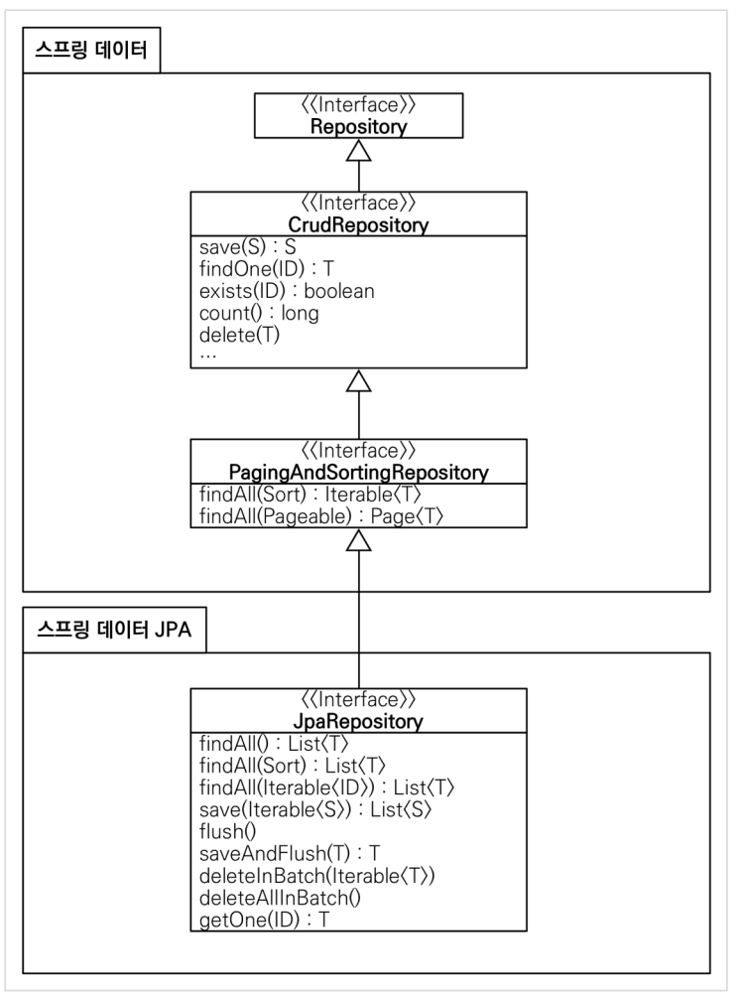

# 스프링 데이터 JPA

스프링 데이터 JPA는 스프링 프레임워크에서 JPA를 편리하게 사용할 수 있도록 지원한다.     
따라서 데이터 접근 계층을 개발할 때 구현 클래스 없이 인터페이스만 작성해도 개발을 완료할 수 있다.


### JpaRepository 인터페이스의 계층 구조

## 쿼리 메소드 기능

스프링 데이터 JPA는 이러한 기능을 제공한다. 바로 메소드 이름만으로 쿼리를 작성해주는 기능이다.

- 메소드 이름으로 쿼리생성
- 메소드 이름으로 JPA NamedQuery 호출
- @Query 어노테이션을 사용해 레포지토리 인터페이스에 쿼리 직접 호출

### 메소드 이름으로 쿼리 생성
JPA는 이름을 분석해 JPQL을 생성하고 실행한다.
```java
public interface MemberRepository extends Repository<Member, Long> {
	List<Member> findByEmailAndName (String email, String name);
}
```
### 메소드 이름으로 JPA NamedQuery 호출
JPA Named 쿼리는 이름 그대로 쿼리에 이름을 부여해서 사용하는 방법인데, 어노테이션이나 XML에 쿼리를 정의할 수 있다.
```java
// 어노테이션 방식
@Entity
@NamedQuery(
    name="Member.findByUsername",
    query="select m from Member m where m.username = :username")
public class Member {
    ...
}
```
```java
// XML 방식
<named-query name="Member.findByUsername">
<query><CDATA[
        select m
        from Member m
        12장_ 스프링 데이터 JPA 547
        where m.username :username
        ]></query>
</named-query>
```
### Query, 리포지터리 메소드에 쿼리 직접 정의
리포지터리 메소드에 직접 쿼리를 정의하려면 Query 어노테이션을 사용한다. 또한 JPA Named 쿼리처럼 애플리케이션 실행 시점에 문법 오류를 발견할 수 있는 장점이 있다.
```java
public interface MemberRepository extends JpaRepository<Member, Long> {
    @Query("select m from Member m where m.username = ?1")
    Member findByUsername (String username);
}
```

```java
public interface MemberRepository extends JpaRepository<Member, Long> {
    @Query(value = "SELECT * FROM MEMBER WHERE USERNAME = ?0”,
        nativeQuery = true)
    Member findByUsername (String username);
}
```
네이티브SQL을 사용하려면 @Query 어노테이션에 'nativeQuery = true'를 설정한다.


###파라미터 바인딩 
스프링 데이터 JPA는 위치 기반 파라미터 바인딩과 이름 기반 파라미터 바인딩을 모두 지원한다.
```java
select m from Member m where m.username = ?1 //위치 기반
select m from Member m where m.username = :name //이름기반
```

###벌크성 수정 쿼리 

스프링 데이터 JPA에서 벌크성 수정, 삭제 쿼리는 Modifying 어노테이션을 사용하면 된다.       
벌크성 쿼리를 실행하고 나서 영속성 컨텍스트를 초기화하고 싶으면 @Modifying(clearAutomatically = true)를 사용하면 된다. 기본값은 false이다.
```java
@Modifying
@Query("update Product p set p.price = p.price * 1.1 where
    p.stockAmount < :stockAmount")
int bulkPriceUp(@Param("stockAmount") String stockAmount);
```


###명세 
이것은 단순히 참이나 것으로 평가된다. 그리고 이것은 AND, OR 같은 연산자로 조합할 수 있다. 명세는 컴포지터 패턴으로 구성되어 있어서 여러 명세를 조합할 수 있다.
####사용자 정의 리포지터리 구현
스프링 데이터 JPA로 리포지터리를 개발하면 인터페이스만 정의하고 구현체는 만들지 않는다. 하지만 다양한 이유로 메소드를 직접 구현해야 할 때도 있다. 그렇다고 리포지터리를 직접 구현하면 공통 인터페이스가 제공하는 기능까지 모두 구현해야 한다. 스프링 데이터 JPA는 이런 문제를 우회해서 필요한 메소드만 구현할 수 있는 방법을 제공한다
###Web 확장
스프링 데이터 프로젝트는 스프링 MVC에서 사용할 수 있는 편리한 기능을 제공한다. 식별자로 도메인 클래스를 바로 바인딩해주는 도메인 클래스 컨버터 기능과, 페이징과 정렬 기능을 알아보자
####설정 
JavaConfig를 사용하면 다음과 같이 EnableSpringDataWebSupport 어노테이션을 사용하면 된다
```java
@Configuration
@EnableWebMvc
@EnableSpringDataWebSupport
public class WebAppConfig {
	...
}
```
설정을 완료하면 도메인 클래스 컨버터와 페이징과 정렬을 위한 HandlerMethodArgumentResolver가 스프링 빈으로 등록된다
####도메인 클래스 컨버터 기능
```java
@Controller
public class MemberController {
    @RequestMapping ("meinber/memberUpdateForm")
    public String memberUpdateForm(@RequestParam("id") Member member,
        Model model) {
            model.addAttribute("member", member);
            return "member/memberSaveFom";
    }
}
```
'@RequestParam("id") Member member' 부분을 보면 HTTP 요청으로 회원 아이디(id)를 받지만 도메인 클래스 컨버터가 중간에 동작해서 아이디를 회원 엔티티 객체로 변환해서 넘겨준다. 따라서 컨트롤러를 단순하게 사용할 수 있다.     
도메인 클래스 컨버터를 통해 넘어온 회원 엔티티를 컨트롤러에서 직접 수정해도 실제 데이터베이스에는 반영되지 않는다. 이는 스프링 데이터와는 관련이 없고 순전히 영속성 컨텍스트의 동작 방식과 관련이 있다.     
- OSIV를 사용하지 않으면: 조회한 엔티티는 준영속 상태다. 따라서 변경 감지기능이 동작하지 않는다. 만약 수정한 내용을 데이터베이스에 반영하고 싶으면 병합(merge)을 사용해야 한다.
- OSIV를 사용하면: 조회한 엔티티는 영속 상태다. 하지만 OSIV의 특성상 컨트롤러와 뷰에서는 영속성 컨텍스트를 플러시하지 않는다. 만약 데이터베이스에 반영하고 싶으면 서비스 계층을 호출해야 한다. 그러면 서비스 계층이 종료될 때 플러시와 커밋이 일어나서 반영될 것이다.
####페이징과 정렬 기능 
스프링 데이터가 제공하는 페이징과 정렬 기능을 스프링 MVC에서 편리하게 사용할 수 있도록 HandlerMethodArgumentResolver를 제공한다.
- 페이징 기능 : PageableHandlerMethodArgumentResolver
- 정렬 기능 : SortHandlerMethodArgumentResolver