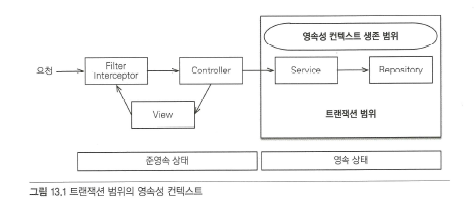
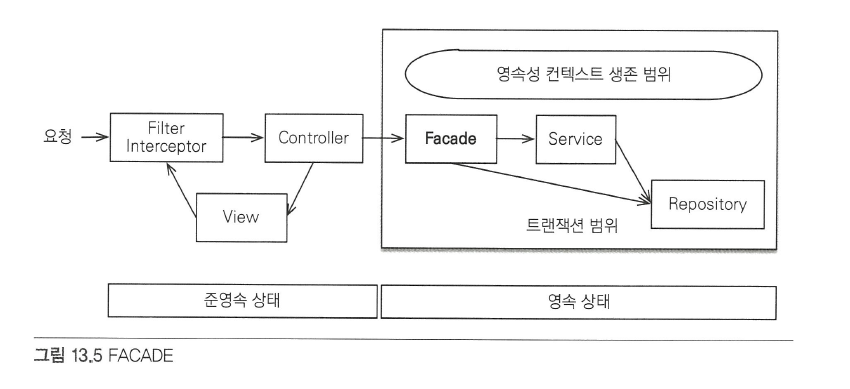
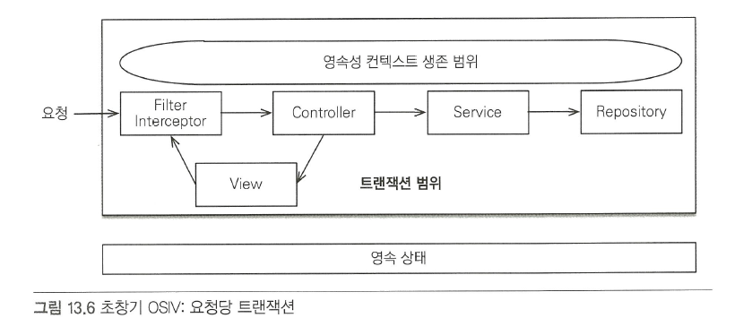

## 웹 애플리케이션과 영속성 관리
컨테이너 환경에서 웹 애플리케이션을 개발할 때 발생할수있는 다양한 문제점과 해결방안을 알아보자.
### 트랜잭션 범위의 영속성 컨텍스트

순수하게 J2SE 환경에서 JPA를 사용하면 개발자가 직접 엔티티 매니저를 생성하고 트랜잭션도 관리해야 한다. 하지만 스프링이나 J2EE 컨테이너 환경에서 JPA를 사용하면 컨테이너가 제공하는 전략을 따라야 한다.
### 스프링 컨테이너의 기본 전략
스프링 컨테이너는 트랜잭션 범위의 영속성 컨텍스트 전략을 기본으로 사용한다. 이 전략은 트랜잭션을 시작할 때 영속성 컨텍스트를 생성하고 트랜잭션이 끝날 때 영속성 컨텍스트를 종료한다.       
그리고 같은 트랜잭션 안에서는 항상 같은 영속성 컨텍스트에 접근한다.     
- 스프링 프레임워크를 사용하면 보통 비즈니스 로직을 시작하는 서비스 계층에 트랙잭션 어노테이션을 선언해서 트랙잭션을 시작한다.
- 이 어노테이션이 있으면 호출한 메소드를 실행하기 직전에 스프링의 트랙잭션 AOA가 먼저 동작한다.   
- 스프링 트랙잭션 AOP는 대상 메소드를 호출하기 직전에 트랜잭션을 시작하고, 대상 메소드가 정상 종료되면 트랜잭션을 커밋하면서 종료한다.
**<H3>트랜잭션이 같으면 같은 영속성 컨텍스트를 사용한다!</H3>**

엔티티 매니저를 사용하는 A,B코드는 모두 같은 트랜잭션 범위에 있다.    
따라서 엔티티 매니저는 달라도 같은 영속성 컨텍스트를 사용한다.
**<H3>트랜잭션이 다르면 다른 영속성 컨텍스트를 사용한다</H3>**

여러 스레드에서 동시에 요청이 와서 같은 엔티티 매니저를 사용해도 트랜잭션에 따라 접근하는 영속성 컨텍스트가 다르다.      
스프링 컨테이너는 스레드마다 각각 다른 트랜잭션을 할당한다.
### 준영속 상태와 지연 로딩

스프링이나 J2EE 컨테이너는 트랜잭션이 **보통 서비스 계층** 에서 시작하므로 서비스 계층이 끝나는 시점에 트랜잭션이 종료되면서 **영속성 컨텍스트도 함께 종료된다**.      
조회한 엔티티가 콘트롤러나 뷰 같은 프리젠테이션 계층에서는 준영속 상태가 된다.

무슨 의미인지 잘모르겠다. 한번 더 봐야겠다

```java
class OrderController {
	public String view(Long orderId) {
		Order order = orderService.findOne(orderId);
		Member member = order.getMember();
		member.getName()//지연 로딩시 예외 발생
	}
}
```
코드를 보니 지연 로딩 시점에 예외가 발생한다고 나와있다.    
.... 무슨 의미인지 정말 궁금하다 
### 준영속 상태의 지연 로딩 문제를 해결하는 방법

- 뷰가 필요한 엔티티를 미리 로딩
- OSIV를 사용해 엔티티를 항상 영속 상태로 유지

뷰가 필요한 엔티티 미리 로딩하는 방법

- 글로벌 페치 전략 수정
  - 가장 간단한 방법은 글로벌 페치 전략을 Eager로 변경하면 된다. 
``` java
  @Entity
public class Order {
@Id @GeneratedValue
private Long id;

	@ManyToOne(fetch = FetchType.EAGER) // 즉시 로딩 전략
	private Member member; // 주문 회원
	
	...
```
  - 엔티티의 페치 타입을 변경하면 애플리케이션 전체에 이 전략을 적용하게 된다. 이를 글로벌 페치 전략이라 한다.
  - 글로벌 페치 전략에 즉시로딩 사용시 단점
    - 사용하지 않는 엔티티 로딩
    - N+1 문제 발생
      - JPA가 JPQL을 분석해서 SQL을 생성할 때는 글로벌 페치 전략을 참고하지 않고 오직 JPQL 자체만 사용한다.
- JPQL 페치 조인
  - N+1 문제가 발생했던 예제에서 JPQL만 페치 조인을 사용하도록 변경하자.
 ```java
JPQL:
select o
from Order o
join fetch o.member

        SQL:
        select o.*, m.*
        from Order o
        join Member m on o.MEMBER_ID = m.MEMBER_ID
  ```
  - 강제로 초기화
    - 영속성 컨텍스트가 살아있을 때 프리젠테이션 계층이 필요한 엔티티를 강제로 초기화해서 반환하는 방법이다.

### FACADE 계층 추가

프리젠테이션 계층과 서비스 계층 사이에 FACADE 계층을 하나 더 두는 방법이다. 덕분에 서비스 계층은 프리젠테이션 계층을 위해 프록시를 초기화 하지 않아도 된다.      
결과적으로 논리적인 의존성을 분리할 수 있다.

#### FACADE 계층의 역할과 특징
- 프리젠테이션 계층과 도메인 모델 계층 간의 논리적 의존성을 분리해준다.
- 프리젠테이션 계층에서 필요한 프록시 객체를 초기화 한다.
- 서비스 계층을 호출해 비즈니스 로직 실행한다.
- 레포지토리를 직접 호출해 뷰가 요구하는 엔티티를 찾는다.

#### 준영속 상태와 지연 로딩의 문제점

**준영속 상태와 지연 로딩의 모든 문제들은 결국 엔티티가 프리젠테이션 계층에서 준영속이기에 발생한다.**

### OSIV

영속성 컨텍스트를 뷰까지 열어둔다는 뜻을 의미 한다.

####과거 OSIV: 요청 당 트랜잭션



그림과 같이 요청이 들어오자마자 서블릿 필터나 스프링 인터셉터에서 영속성 컨텍스트를 만들면서 트랜잭션을 시작하고 요청이 끝날 때 트랜잭션과 영속성 컨텍스트를 함께 종료한다

####  요청 당 트랜잭션 방식의 OSIV 문제점
요청 당 트랜잭션 방식의 OSIV가 가지는 문제점은 컨트롤러나 뷰 같은 프리젠테이션 계층이 엔티티를 변경할 수 있다는 점이다. 프리젠테이션 계층에서 엔티티를 수정하지 못하게 막는 방법들은 다음과 같다.
- 엔티티를 읽기 전용 인터페이스로 제공
  - 엔티티를 직접 노출하는 대신에 다음 예제와 같이 읽기 전용 메소드만 제공하는 인터페이스를 프리젠테이션 계층에 제공하는 방법이다.

- 엔티티 래핑
  - 엔티티의 읽기 전용 메소드만 가지고 있는 엔티티를 감싼 객체를 만들고 이것을 프리젠테이션 계층에 반환하는 방법이다
- DTO만 반환
  - 가장 전통적인 방법으로 프리젠테이션 계층에 엔티티 대신에 단순히 데이터만 전달하는 객체인 DTO를 생성해서 반환하는 것이다.


### 스프링 OSIV: 비즈니스 계층 트랜잭션

OSIV를 서블릿 필터에서 적용할지 스프링 인터셉터에서 적용할 지에 따라 원하는 클래스를 선택해서 사용하면 된다.
#### 스프링 OSIV 분석


스프링 프레임워크가 제공하는 OSIV는 비즈니스 계층에서 트랜잭션을 사용하는 OSIV다.    
#### OSIV 정리
#### 스프링 OSIV의 특징
- 한 번 조회한 엔티티는 요청이 끝날 때까지 영속 상태를 유지한다.
- 엔티티 수정은 트랜잭션이 있는 계층에서만 동작한다.
#### 스프링 OSIV의 단점
- OSIV를 적용하면 같은 영속성 컨텍스트를 여러 트랜잭션이 공유할 수 있다는 점을 주의해야 한다.
- 프리젠테이션 계층에서 엔티티를 수정 하고나서 비즈니스 로직을 수행하면 엔티티가 수정될 수 있다.
- 프리젠테이션 계층에서 지연 로딩에 의한 SQL이 실행된다. 따라서 성능 튜닝시에 확인해야 할 부분이 넓다.