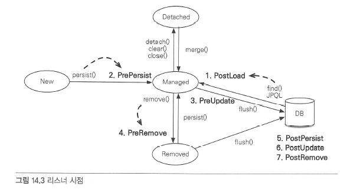

##컬렉션 
JPA는 자바에서 기본으로 제공하는 Collection, List, Set, Map 컬렉션을 지원하고 다음 경우에 이 컬렉션을 사용할 수 있다. 컬렉션이 필요한 경우는 다음과 같다. 
- @OneToMany, @ManyToMany를 사용해서 일대다나 다대다 엔티티 관계를 매핑할때
- @ElementCollection을 사용해서 값 타입을 하나 이상 보관할 때
### 자바 컬렉션 특징
- Collection : 자바가 제공하는 최상위 컬렉션이다. 하이버네이트는 중복을 허용하고 순서를 보장하지 않는다고 가정한다.
- Set : 중복을 허용하지 않는 컬렉션이다. 순서를 보장하지 않는다.
- List : 순서가 있는 컬렉션이다. 순서를 보장하고 중복을 허용한다.
- Map : Key, Value 구조로 되어 있는 특수한 컬렉션이다.
### JPA와 컬렉션
하이버네이트는 엔티티를 영속 상태로 만들 때 컬렉션 필드를 하이버네이트에서 준비한 컬렉션으로 감싸서 사용한다.     
하이버네이트는 컬렉션을 효율적으로 관리하기 위해 엔티티를 영속 상태로 만들 때 원본 컬렉션을 감싸고 있는 내장 컬렉션을 생성해서 이 내장 컬렉션을 사용하도록 참조를 변경한다. 하이버네이트가 제공하는 내장 컬렉션은 원본 컬렉션을 감싸고 있어서 래퍼 컬렉션으로도 부른다.

### Collection, List
Collection, List는 엔티티를 추가할 때 중복된 엔티티가 있는지 비교하지 않고 단순히 저장만 하면 된다. 따라서 엔티티를 추가해도 지연 로딩된 컬렉션을 초기화하지 않는다.
### Set
HashSet은 중복을 허용하지 않으므로 add() 메소드로 객체를 추가할 때 마다 equals() 메소드로 같은 객체가 있는지 비교한다.   
같은 객체가 없으면 객체를 추가하고 true를 반환하고, 같은 객체가 이미 있어서 추가에 실패하면 false를 반환한다. 참고로 HashSet은 해시 알고리즘을 사용하므로 hashcode()도 함께 사용해서 비교한다.
Set은 엔티티를 추가할 때 중복된 엔티티가 있는지 비교해야 한다. 따라서 엔티티를 추가할 때 지연 로딩된 컬렉션을 초기화한다.
### List + @OrderColumn
순서가 있다는 의미는 데이터베이스에 순서 값을 저장해서 조회할 때 사용한다는 의미다.
```java
@Entity
public class Board {

    @Id @GeneratedValue
    private Long id;

	...

    @OneToMany(mappedBy = "board")
    @OrderColumn(name = "POSITION")
    private List<Comment> comments = new ArrayList<Comment>();

}
```
### 리스너
JPA 리스너 기능을 사용하면 엔티티의 생명주기에 따른 이벤트를 처리할 수 있다.

1. PostLoad : 엔티티가 영속성 컨텍스트에 조회된 직후 또는 refresh를 호출한 후(2차 캐시에 저장되어 있어도 호출된다.)
2. PrePersist : persist() 메소드를 호출해서 엔티티를 영속성 컨텍스트에 관리하기 직전에 호출된다.
3. PreUpdate : flush나 commit을 호출해서 엔티티를 데이터베이스에 수정하기 직전에 호출된다.
4. PreRemove : remove() 메소드를 호출해서 엔티티를 영속성 컨텍스트에서 삭제하기 직전에 호출된다. 또한 삭제 명령어로 영속성 전이가 일어날 때도 호출된다. orphanRemoval에 대해서는 flush나 commit 시에 호출된다.
5. PostPersist : flush나 commit을 호출해서 엔티티를 데이터베이스에 저장한 직후에 호출된다. 식별자가 항상 존재한다. 참고로 식별자 생성 전략이 IDENTITY면 식별자를 생성하기 위해 persist()를 호출하면서 데이터베이스에 해당 엔티티를 저장하므로 이때는 persist()를 호출한 직후에 바로 PostPersist가 호출된다.
6. PostUpdate : flush나 commit을 호출해서 엔티티를 데이터베이스에 수정한 직후에 호출된다.
7. PostRemove : flush나 commit을 호출해서 엔티티를 데이터베이스에 삭제한 직후에 호출된다.
### 이벤트 적용 위치
이벤트는 엔티티에서 직접 받거나 별도의 리스터를 등록해서 받을 수 있다.
- 엔티티에 직접 적용
- 별도의 리스너 등록
- 기본 리스너 사용
#### 엔티티에 직접 적용
```java 
@Entity
public class Duck {
	@Id @GeneratedValue
	private Long id;

	private String name;

	@PrePersist
	public void prePersist() {
		System.out.println("Duck.prePersist id=" + id);
	}

	@PostPersist
	public void postPersist() { 
		System.out.println("Duck.postPersist id=" + id);
	}

	@PostLoad
	public void postLoad() {
		 System.out.println("Duck.postLoad");
	}

	@PreRemove
	public void preRemove() {
		 System.out.println("Duck.preRemove");
	}

	@PostRemove
	public void postRemove() {
		 System.out.println("Duck.postRemove");
	}

}
```
####별도의 리스너 등록
```java
@Entity
@EntityListeners(DuckListener.class)
public class Duck {
	...
}

public class DuckListener {

	@PrePersist
	// 특정 타입이 확실하면 특정 타입을 받을 수 있다. 
	private void perPersist(Object obj) {
		System.out.println("DuckListener.prePersist obj = [" + obj + "]");
	}

	@PostPersist
	// 특정 타입이 확실하면 특정 타입을 받을 수 있다. 
	private void postPersist(Object obj) {
		System.out.println("DuckListener.postPersist obj = [" + obj + "]");
	}
}
```
####기본 리스너 사용
```java
<?xml version="1.0" encoding="UTF-8"?>
<entity-mappings ...>
	<persistence-unit-metadata>
		<persistence-unit-defaults>
			<entity-listeners>
				<entity-listener class="jpabook.jpashop.domain.
					test.listener.DefaultListener" />
			</entity-listeners>
		</persistence-unit-defaults>
	<persistence-unit-metadata>

</entity-mappings>
```
###엔티티 그래프
글로벌 fetch 옵션은 애플리케이션 전체에 영향을 주고 변경할 수 없는 단점이 있다. 그래서 일반적으로 글로벌 fetch 옵션은 FetchType.LAZY를 사용하고, 엔티티를 조회할 때 연관된 엔티티를 함께 조회할 필요가 있으면 JPQL의 페치 조인을 사용한다.
그런데 페치 조인을 사용하면 같은 JPQL을 중복해서 작성하는 경우가 많다.
```java
// case 1
select o from Order o
	where o.status = ?

// case 2
select o from Order o
	join fetch o.member 
	where o.status = ?

// case 3
select o from Order o
	join fetch o.orderItems
	where o.status = ?
 ```
3가지 JPQL 모두 주문을 조회하는 JPQL이지만 함께 조회할 엔티티에 따라서 다른 JPQL을 사용해야 한다.    
이는 엔티티 그래프를 사용해서 연관된 엔티티를 함께 조회하면 되고 JPQL은 데이터를 조회하는 기능만 수행할 수 있다.


