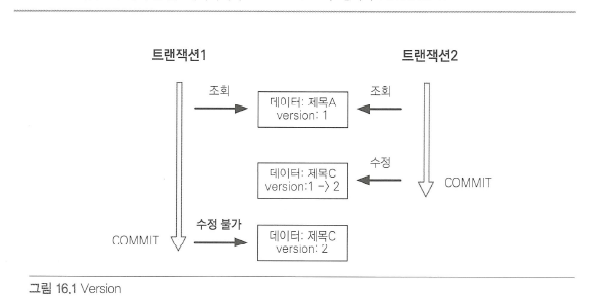
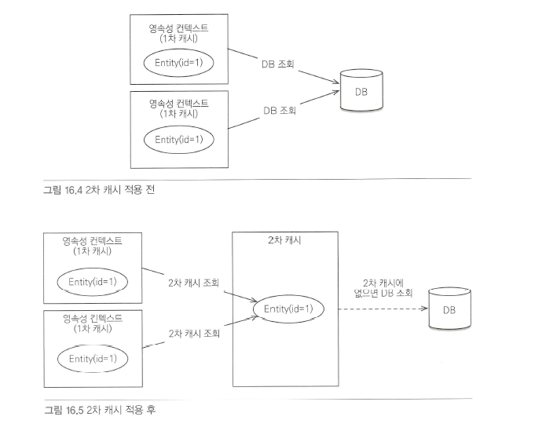
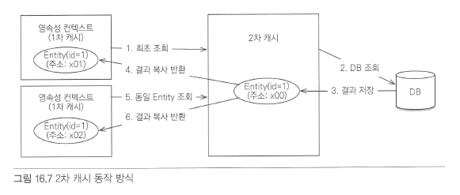

# 트랜잭션과 락
트랜잭션 기초와 JPA가 제공하는 낙관적 락과 비관적 락에 대해 알아보자
## 트랜잭션과 격리 수준
트랜잭션은 ACID라 하는 원자성(Atomicty), 일관성(Consistency), 격리성(Isolation), 지속성(Durability)을 보장해야 한다.
- 원자성 : 트랜잭션 내에서 실행한 작업들은 마치 하나의 작업인 것처럼 모두 성공 하든가 모두 실패해야 한다.
- 일관성 : 모든 트랜잭션은 일관성 있는 데이터베이스 상태를 유지해야 한다.
- 격리성 : 동시에 실행되는 트랜잭션들이 서로에게 영향을 미치지 않도록 격리한다.
- 지속성 : 트랜잭션을 성공적으로 끝내면 그 결과가 항상 기록되어야 한다.
- 
  문제는 격리성인데 트래잭션 간에 격리성을 완벽히 보장하려면 트랜잭션을 거의 차례대로 실행해야 한다. 이런 문제로 인해 ANSI 표준은 트랜잭션의 격리 수준을 4단계로 나누어 정의했다.
  - READ UNCOMMITED(커밋되지 않은 읽기)
  - READ COMMITTED(커밋된 읽기)
  - REPEATABLE READ(반복 가능한 읽기)
  - SERIALIZABLE(직렬화 가능)
  격리 수준에 따른 문제점은 다음과 같다.
  - READ UNCOMMITTED : 커밋하지 않은 데이터를 읽을 수 있다.
  - READ COMMITED : 커밋한 데이터만 읽을 수 있다.
  - REPEATABLE READ : 한 번 조회한 데이터를 반복해서 조회해도 같은 데이터가 조회된다.
  - SERIALIZABLE : 가장 엄격한 트랜잭션 격리 수준이다. 여기서는 PHANTOM READ가 발생하지 않는다.
### 낙관적 락과 비관적 락 기초
JPA는 데이터베이스 트랜잭션 격리 수준을 READ COMMITED 정도로 가정한다. 만약 일부 로직에 더 높은 격리 수준이 필요하면 낙관적 락과 비관적 락 중 하나를 사용하면 된다.
낙관적 락
- 데이터베이스가 제공하는 락 기능을 사용하는 것이 아니라 JPA가 제공하는 버전 관리 기능을 사용한다. 트랜잭션을 커밋하기 전까지는 트랜잭션의 충돌을 알 수 없다는 특징이 있다.
비관적 락
- 트랜잭션의 충돌이 발생한다고 가정하고 우선 락을 걸고 보는 방법이다. 데이터베이스가 제공하는 락 기능을 사용한다. 대표적으로 select for update 구문이 있다.

### @Version
JPA가 제공하는 낙관적 락을 사용하려면 @Version 어노테이션을 사용해서 버전 관리 기능을 추가해야 한다.     
@Version 적용 가능 타입    
- long (long)
- Integer (int)
- Shoort (short)
- Timestamp
```java
@Entity
public class Board {

	@Id
	private String id;
	private String title;

	@Version
	private Integer version;
}
```

이제부터 엔티티를 수정할 때 마다 버전이 하나씩 자동으로 증가한다. 그리고 엔티티를 수정할 때 조회 시점의 버전과 수정 시점의 버전이 다르면 예외가 발생한다.
```java
// 트랜잭션 1 조회 title="제목A", version=1
Board board = em.find(Board.class, id);

// 트랜잭션 2에서 해당 게시물을 수정해서 title="제목C", version=2로 증가

board.setTitle("제목B"); // 트랜잭션 1 데이터 수정

save(board);
tx.commit(); //예외 발생, 데이터베이스 version=2, 엔티티 version=1

```



트랜잭션 1이 데이터를 제목 B로 변경하고 트랜잭션을 커밋하는 순간 엔티티를 조회할 때 버전과 데이터베이스의 현재 버전 정보가 다르므로 예외가 발생한다.      
따라서 버전 정보를 사용하면 최초 커밋만 인정하기가 적용된다.

###JPA 락 사용

JPA를 사용할 때 추천하는 전략은 READ COMMITTED 트랜잭션 격리 수준 + 낙관적 버전 관리다. (두 번의 갱신 내역 분실 문제 예방)       
락은 다음 위치에 적용할 수 있다.    
- EntityManager.lock(), EntityManager.find(), EntityManager.refresh()     
- Query.setLockMode() (TypeQuery 포함)     
- @NamedQuery    
### 2차 캐시
1차 캐시와 2차 캐시
영속성 컨텍스트로 얻을 수 있는 이점이 많지만, 일반적인 웹 애플리케이션 환경은 트랜잭션을 시작하고 종료할 때까지만 1차 캐시가 유효하다. OSIV를 사용해도 클라이언트의 요청이 들어올 때부터 끝날 때까지만 1차 캐시가 유효하다. 따라서 애플리케이션 전체로 보면 데이터베이스 접근 횟수를 획기적으로 줄이지는 못한다.     
하이버네이트를 포함한 대부분의 JPA 구현체들은 애플리케이션 범위의 캐시를 지원하는데 이것을 공유 캐시 또는 2차 캐시라 한다.     




### 2차 캐시
2차 캐시는 애플리케이션 범위의 캐시가.      
따라서 애플리케이션을 종료할 때까지 캐시가 유지된다.      
분산 캐시나 클러스터링 환경의 캐시는 애플리케이션보다 더 오래 유지될 수도 있다.      
2차 캐시를 적절히 활용하면 데이터베이스 조회 횟수를 획기적으로 줄일 수 있다.

2차 캐시는 동시성을 극대화하려고 캐시 한 객체를 직접 반환하지 않고 복사본을 만들어서 반환한다. 만약 캐시한 객체를 그대로 반환하면 여러 곳에서 같은 객체를 동시에 수정하는 문제가 발생할 수 있다.      
이 문제를 해결하려면 객체에 락을 걸어야 하는데 이렇게 하면 동시성이 떨어질 수 있다.
### JPA 2차 캐시 기능
캐시 모드 설정
2차 캐시를 사용하려면 javax.persistence.Cacheable 어노테이션을 사용하면 된다.
- @Cacheable
- @Entity
```java
public class Member {
@Id @GeneratedValue
private Long id;
...
}
```
### 하이버네이트와 EHCACHE 적용
하이버네이트가 지원하는 캐시는 크게 3가지가 있다.
- 엔티티 캐시 : 엔티티 단위로 캐시한다. 식별자로 엔티티를 조회하거나 컬렉션이 아닌 연관된 엔티티를 로딩할 때 사용한다.
- 컬렉션 캐시 : 엔티티와 연관된 컬렉션을 캐시한다. 컬렉션이 엔티티를 담고 있으면 식별자 값만 캐시한다(하이버네이트 기능)
- 쿼리 캐시 : 쿼리와 파라미터 정보를 키로 사용해서 캐시한다. 결과가 엔티티면 식별자 값만 캐시한다.(하이버네이트 기능)
### 쿼리 캐시
쿼리 캐시는 쿼리와 파라미터 정보를 키로 사용해서 쿼리 결과를 캐시하는 방법이다. 쿼리 캐시를 적용하려면 유닛을 설정에 hibernate.cache.use_query_cache 옵션을 꼭 true로 설정해야 한다.
```java 
// 쿼리 캐시 적용
em.createQuery("select i from Item i", Item.class)
		.setHint("org.hibernate.cacheable", true)
		.getResultList();
```

```java
// NamedQuery에 쿼리 캐시 적용
@Entity
@NamedQuery(
				hints = @QueryHint(name = "org.hibernate.cacheable",
					value = "true"),
				name = "Member.findByUsername",
				query = "select m.address from Member m where m.name = :username"
)
public class Member {
	...
}
```

### 쿼리 캐시와 컬렉션 캐시의 주의점
엔티티 캐시를 사용해서 엔티티를 캐시하면 엔티티 정보를 모두 캐시 하지만 쿼리 캐시와 컬렉션 캐시는 결과 집합의 식별자 값만 캐시한다.      
문제는 쿼리 캐시나 컬렉션 캐시만 사용하고 대상 엔티티에 엔티티 캐시를 적용하지 않으면 성능상 심각한 문제가 발생할 수 있다.
- select m from Member m 쿼리를 실행 했는데 쿼리 캐시가 적용되어 있다. 결과 집합은 100건이다.
- 결과 집합에는 식별자만 있으므로 한 건씩 엔티티 캐시 영역에서 조회한다.
- Member 엔티티는 엔티티 캐시를 사용하지 않으므로 한 건씩 데이터베이스에서 조회한다.
- 결국 100건의 SQL이 실행된다.
따라서 쿼리 캐시나 컬렉션 캐시를 사용하면 결과 대산 엔티티에는 꼭 엔티티 캐시를 적용해야 한다.


